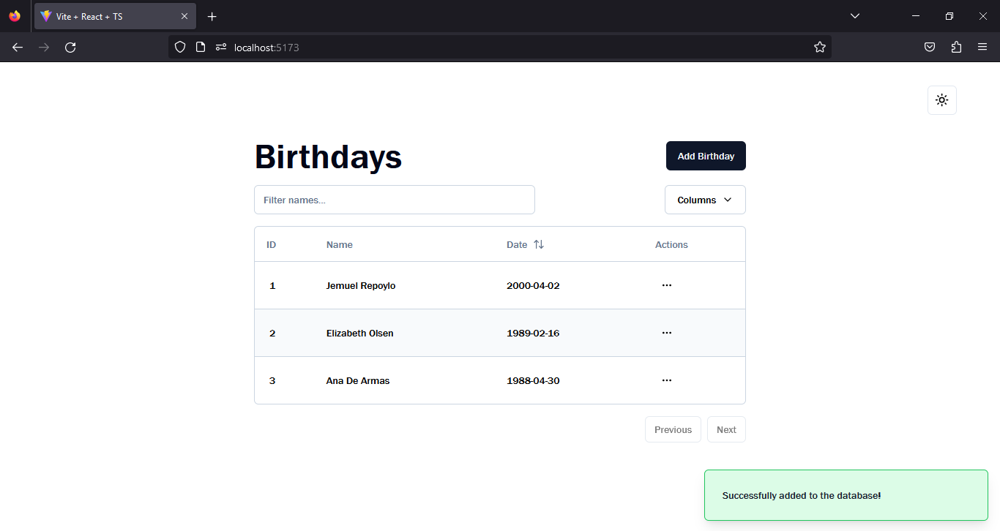
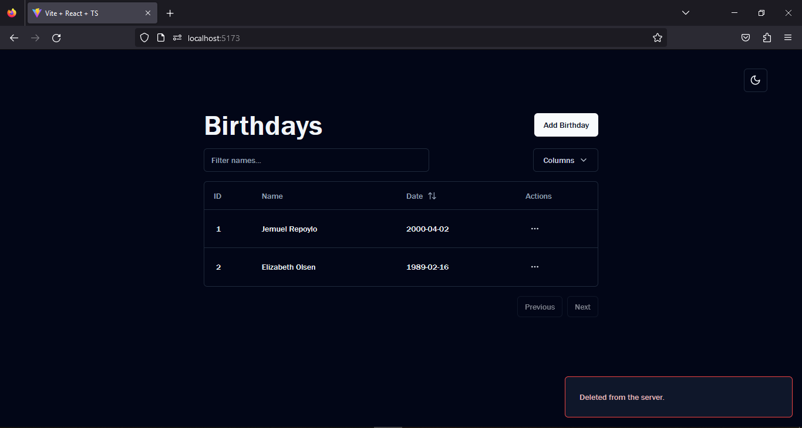

<div align="center">

# Flask API - CRUD APPLICATION

</div>

<div align="center">

[](https://react.dev/) &nbsp;
[](https://www.typescriptlang.org/) &nbsp;

&nbsp;

<br>


</div>

<br>
<br>

## **Preview**

<div align='center'>
    
</div>

<div align='center'>
    
</div>

<br>
<br>

```
- git clone https://github.com/syjem/react-flask.git
```

## Client

```
- cd client
- npm install
- npm run dev
```

<br>

## API

```
- cd api
```

- create a requirements.txt

```
blinker==1.6.3
click==8.1.7
colorama==0.4.6
Flask==3.0.0
Flask-Cors==4.0.0
Flask-SQLAlchemy==3.1.1
greenlet==3.0.0
itsdangerous==2.1.2
Jinja2==3.1.2
MarkupSafe==2.1.3
python-dotenv==1.0.0
SQLAlchemy==2.0.22
sqlparse==0.4.4
termcolor==2.3.0
typing_extensions==4.8.0
Werkzeug==3.0.0
```

- Create a virtual environment /.venv

- Install requirements.txt

```
- flask run
```

<br>
<br>

- POST REQUEST

```py
    # POST REQUEST
    if request.method == 'POST':
        data = request.get_json()
        name = data.get("name")
        date = data.get("date")

        if not name:
            return jsonify({"error": "Please enter a valid name."})
        if not date:
            return jsonify({"error": "Please enter a valid date."})

        info = Birthdays(name=name, date=date)
        db.session.add(info)
        db.session.commit()
        return jsonify({"success": "Successfully added to the database!"})
```

<br>

- PATCH REQUEST

```py
    # PATCH REQUEST
    if request.method == "PATCH":
        data = request.get_json()
        id = data.get("id")
        name = data.get("name")
        date = data.get("date")

        row = Birthdays.query.get(id)
        if row:
            if name is not None:
                row.name = name
            if date is not None:
                row.date = date
            db.session.commit()
            return jsonify({"success": "Updated successfully."})
        else:
            return jsonify({"error": "Not found."})
```

<br>

- DELETE REQUEST

```py
    # DELETE REQUEST
    if request.method == 'DELETE':
        data = request.get_json()
        id = data.get("id")

        row = Birthdays.query.get(id)
        if row:
            db.session.delete(row)
            db.session.commit()
            return jsonify({'success': "Deleted from the server."})
        else:
            return jsonify({"error": "Not found."})
```

- GET REQUEST

```py
    # GET REQUEST
    birthdays = Birthdays.query.all()
    birthday_data = [{'id': birthday.id, "name": birthday.name, "date": birthday.date} for birthday in birthdays]
    return jsonify(birthday_data)
```

<br>
